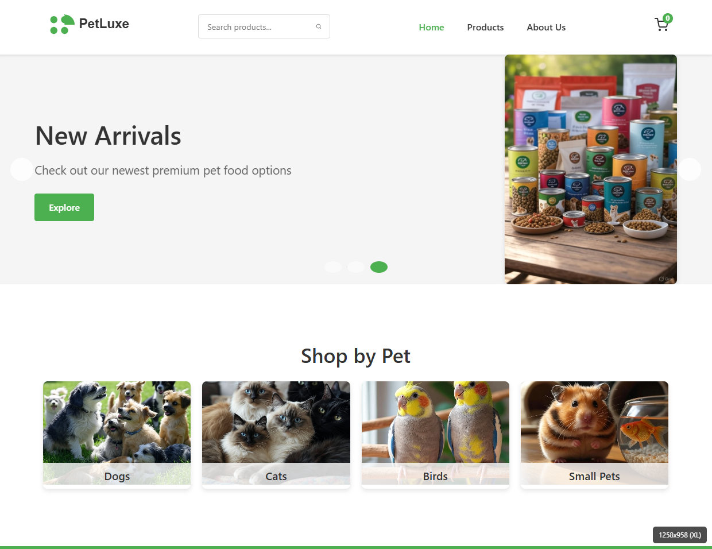

# PetLuxe Ecommerce Website


A responsive multipage ecommerce website for pet products and accessories built with HTML5, CSS3, and JavaScript.

## 📋 Overview

PetLuxe is a fully responsive ecommerce website that allows users to browse and purchase pet supplies. The site includes multiple pages such as home, products listing, product details, shopping cart, checkout, and about/contact pages.

**Live Demo**: [View the live site on GitHub Pages](https://NMsby.github.io/pet-ecommerce/)



## ✨ Features

### 🛍️ Shopping Experience
- Product browsing by category
- Product filtering by price and other attributes
- Product search functionality
- Detailed product pages with image gallery
- Recently viewed products tracking

### 🛒 Cart & Checkout
- Add to cart functionality
- Cart management (update quantities, remove items)
- Persistent cart using localStorage
- Checkout process with form validation
- Order confirmation

### 📱 Responsive Design
- Mobile-first approach
- Works on all device sizes (mobile, tablet, desktop)
- Touch-friendly interfaces
- Optimized images and performance

### 🎯 User Experience
- Intuitive navigation
- Product search functionality
- Form validation with helpful error messages
- Loading indicators for asynchronous operations
- Smooth animations and transitions

## 🔧 Technologies Used

- **HTML5** - Semantic markup
- **CSS3** - Styling with flexbox and grid layouts
- **JavaScript** - Interactive functionality and DOM manipulation
- **Local Storage API** - For cart and user preferences persistence
- **Fetch API** - For loading product data

## 📂 Project Structure

```
pet-ecommerce/
├── index.html                  # Homepage
├── products.html               # Products listing page
├── product-detail.html         # Individual product page
├── cart.html                   # Shopping cart page
├── about.html                  # About us and contact page
├── css/
│   ├── style.css               # Main stylesheet
│   └── responsive.css          # Media queries and responsive styles
├── js/
│   ├── main.js                 # Core functionality (navigation, search, etc.)
│   ├── products.js             # Products listing and detail functionality
│   └── cart.js                 # Shopping cart and checkout functionality
├── assets/
│   ├── images/                 # Product and site images
│   └── icons/                  # SVG icons and logos
└── data/
    └── products.json           # Product database
```

## 📱 Responsive Breakpoints

The website is designed to work on all device sizes with the following major breakpoints:

- **Mobile**: < 576px
- **Small tablets**: 576px - 767px
- **Tablets**: 768px - 991px
- **Desktops**: 992px - 1199px
- **Large desktops**: ≥ 1200px

## 🚀 Getting Started

### Prerequisites

- A modern web browser (Chrome, Firefox, Safari, Edge)
- Git for version control

### Installation

1. Clone the repository:
   ```bash
   git clone https://github.com/NMsby/pet-ecommerce.git
   ```

2. Navigate to the project directory:
   ```bash
   cd pet-ecommerce
   ```

3. Open `index.html` in your browser to view the site locally.

### Development

This project uses plain HTML, CSS, and JavaScript, so you don't need any build tools or dependencies to work on it. Edit the files in your favorite code editor.

## 🌐 Deployment

### Deploying to GitHub Pages

1. Push your code to a GitHub repository
2. Go to repository Settings → Pages
3. Select the `main` branch as the source
4. Click Save
5. Your site will be published at `https://NMsby.github.io/pet-ecommerce/`

### Deploying to a Custom Server

1. Upload all files to your web server via FTP or your preferred method
2. Ensure the file structure remains intact
3. No server-side setup is required as this is a static website

## 🔄 Future Improvements

- User authentication and account management
- Wishlist functionality
- Product reviews and ratings input
- Payment gateway integration
- Product filtering by more attributes
- Product sorting options

## 📝 License

This project is licensed under the MIT License - see the [LICENSE](LICENSE) file for details.

## 👏 Acknowledgments

- Images sourced from [Grok](https://grok.com)
- Icons from [Feather Icons](https://feathericons.com)
- Inspiration from various pet supply websites